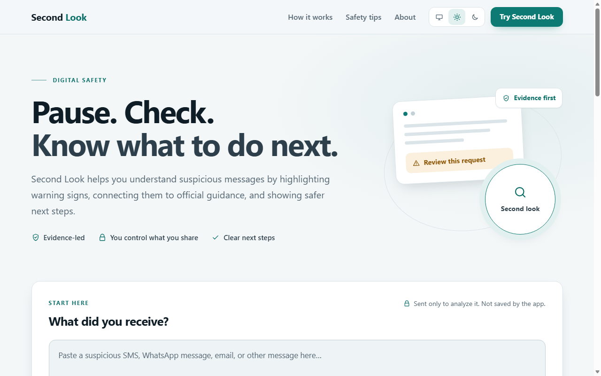
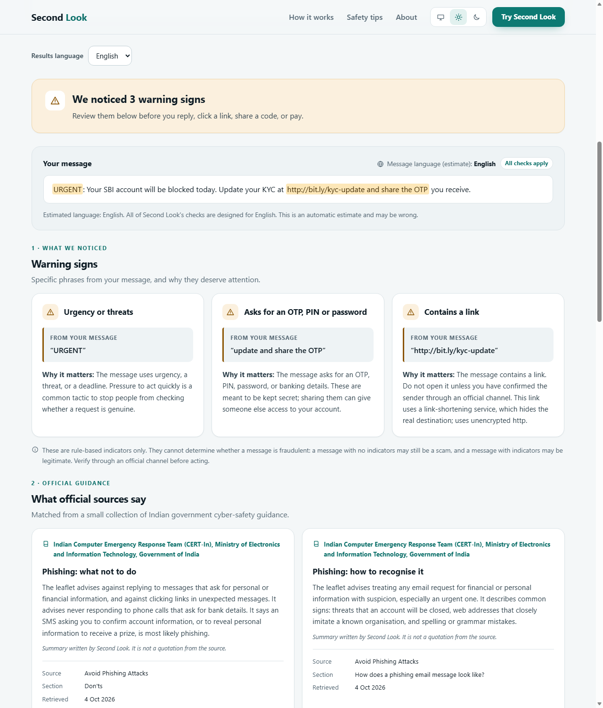
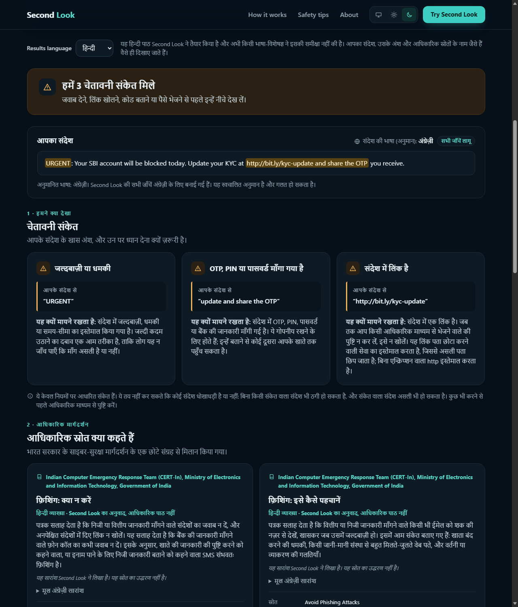
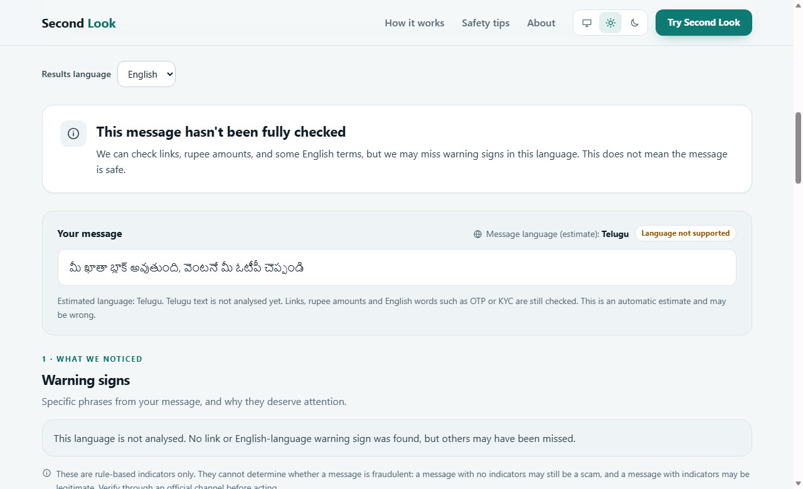
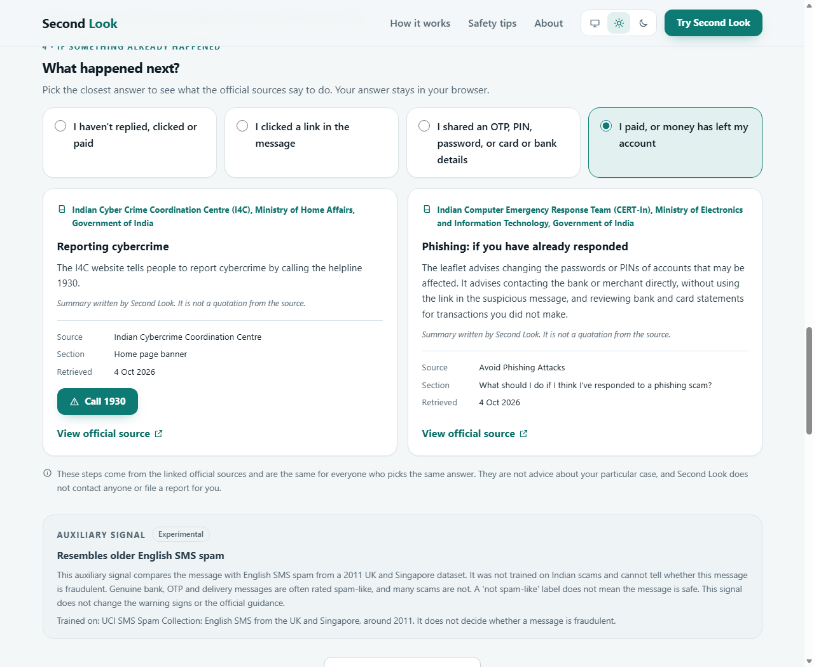

# Second Look

**Pause. Check. Know what to do next.**

Second Look helps people in India take a second look at a suspicious SMS, WhatsApp message or email before they reply, click or pay. It points to the specific phrases that deserve attention, links them to guidance published by Indian government bodies, and shows what to do next.

It does not decide whether a message is a scam. It shows evidence and official advice, and it says plainly what it could not check.

- **Live app:** https://second-look-ai-1.onrender.com
- **Backend health check:** https://second-look-ai.onrender.com/health
- **Source:** https://github.com/maimunaafrah341-maker/second-look-ai

The backend may be slow to answer the first request after it has been idle.

Built for the ML Empowerment Build Challenge 3.0 and ForgeHacks (October 2026).



## The problem

Fraud messages work by rushing people: an account will be blocked today, a parcel is held, a prize needs a fee. Tools that answer "scam" or "safe" are easy to trust too much, and a wrong "safe" is dangerous.

Second Look takes a different approach. It slows the reader down, shows exactly which words in the message are warning signs and why, and sends them to the official source and helpline. A message with no warning signs is never described as safe.

## What it does

| Feature | What you see |
| --- | --- |
| Warning signs | Up to four rule-based findings, each with the exact excerpt from your message and a plain-language reason |
| Official guidance | Matching passages from Indian government cyber-safety documents, with publisher, section, date and a link to the source |
| Safer next steps | General steps for any suspicious message, plus a "What happened next?" chooser for people who have already clicked, shared details or lost money |
| Results in English or Hindi | A "Results language" selector that changes how results are presented, without re-analysing the message |
| Honest coverage | A label and summary that say when a message was only partly checked, or not checked at all |
| Auxiliary signal | An experimental spam-likeness label, shown last and clearly marked as not a fraud judgement |

### English results



### Hindi results, dark theme

The same analysis, presented in Hindi. The message, the quoted excerpts and the names of official sources are never translated. The Hindi text was written by this project and has not been reviewed by a language specialist; the app says so on screen.



### A language that is not analysed

Second Look does not report "no warning signs" for a language it cannot read.



### If something already happened



## Language coverage

| Message language | Coverage | What is checked |
| --- | --- | --- |
| English | All checks apply | Warning-sign rules, guidance retrieval and the auxiliary classifier |
| Hindi (Devanagari) | Partial | A limited list of Hindi scam phrases; guidance through a small Hindi term map; no classifier |
| Hindi in English letters | Partial | A limited list of romanised phrases and spellings; guidance through the term map; no classifier |
| Mixed languages | Partial | English parts fully; other parts partly or not at all |
| Telugu, Urdu, Bengali, others | Not supported | Only links, rupee amounts and English words such as OTP or KYC |

The language is estimated automatically from the script and a few keywords, and the estimate can be wrong.

Rules and a term map for Telugu, Urdu and Bengali exist in the repository but are switched off. They were written by a non-native speaker and are waiting for review by native speakers ([docs/native_review_checklist.md](docs/native_review_checklist.md)). Tests confirm that no request can switch them on.

## How it works

```
Browser (React)                         FastAPI backend
───────────────                         ───────────────
paste message ──── POST /analyze ─────► 1. estimate language (script + keywords)
                                        2. warning-sign rules (regular expressions)
                                        3. guidance retrieval (TF-IDF over a small corpus)
                                        4. auxiliary classifier (English only)
show results  ◄─── JSON ──────────────  findings, guidance, classifier, language

choose what   ──── GET /next-steps ───► fixed steps from verified guidance passages
happened next ◄─── JSON ──────────────
```

The four parts are independent. The classifier never changes the findings or the guidance, and there is no combined score.

### 1. Warning-sign rules

Hand-written patterns look for four things. Each finding quotes the matching excerpt from the message.

| Category | What it flags |
| --- | --- |
| `urgency_pressure` | Urgency, threats and artificial deadlines |
| `credential_request` | Requests for an OTP, PIN, password or banking details |
| `link` | Any link, with a note when it is shortened, uses an IP address, uses punycode, hides the address behind `@`, or uses plain `http` |
| `payment_demand` | Payment demands, transfers, fees and pay-to-release-a-reward requests |

Safety advice such as "never share your OTP" is recognised and not flagged as a request. Links are never opened or fetched.

### 2. Official-guidance retrieval

A small corpus holds summaries of five documents from the Indian Cyber Crime Coordination Centre (I4C) and CERT-In. Retrieval is plain TF-IDF keyword similarity written in Python, with no embeddings and no language model.

A passage is returned only if it is similar enough, shares at least two terms with the message, and satisfies that passage's required word groups. At most three passages are returned. Hindi and romanised-Hindi words reach the English passages through a term map of 97 entries.

Each summary is written by this project and labelled as such; it is not a quotation. Eight passages are served. Two more, from the digital-arrest advisory, are held back until a person has checked them against the original. Sources, verification steps and licensing notes are in [docs/guidance_sources.md](docs/guidance_sources.md).

### 3. Auxiliary classifier

A character TF-IDF and logistic regression model, trained on the UCI SMS Spam Collection (English SMS from the UK and Singapore, around 2011). It answers one narrow question: does this message resemble that older spam?

- It runs only when the message is estimated to be English. It is not run for Hindi, romanised Hindi, Telugu, Urdu, Bengali or mixed messages, or when no language can be identified (for example a message that is only digits, emoji or a link).
- It returns a label, `spam_like` or `not_spam_like`, and never a score.
- It is shown last, marked experimental, with a notice that it cannot tell whether a message is fraudulent.

Details are in [docs/classifier.md](docs/classifier.md).

### 4. Next steps

`GET /next-steps` returns the same fixed steps for everyone, looked up from the verified guidance passages. Where money has been lost, reporting to the national cybercrime helpline 1930 comes first. Nothing about the message is sent to this endpoint.

## Evaluation

All results below come from files in this repository and can be reproduced with the commands shown. None of them measures real-world fraud detection in India.

### Classifier, on UCI SMS spam

Held-out test split of 1,035 messages (904 legitimate, 131 spam). Exact duplicates were removed, and near-duplicates above a similarity threshold were grouped so that a group never sits on both sides of the split. More heavily reworded templates can still do so.

| Model | Spam precision | Spam recall | Spam F1 | False-positive rate |
| --- | --- | --- | --- | --- |
| Majority class | 0.000 | 0.000 | 0.000 | 0.00% |
| Word TF-IDF + Naive Bayes | 0.959 | 0.885 | 0.921 | 0.55% |
| Character TF-IDF + Logistic Regression (used) | 0.919 | 0.954 | 0.936 | 1.22% |

The selected model flagged 11 legitimate messages and missed 6 spam messages. Its threshold was tuned for a 1% false-positive rate on validation and **did not meet that target on the test split**.

These numbers describe English SMS spam from 2011. Spam is not the same as fraud, and the model has never seen an Indian scam or a genuine Indian bank message. In this project's own tests, a genuine bank debit alert is rated spam-like and a hand-written digital-arrest message is rated not spam-like. Full protocol and robustness runs: [docs/model_evaluation.md](docs/model_evaluation.md).

### Guidance retrieval, on a hand-written set

70 messages written by this project: 40 used while adjusting the matching rules, and 30 written after the rules were frozen and run once.

| Part | Scored | Correct matches | False matches | Missed | Correct silences | Precision | Recall |
| --- | --- | --- | --- | --- | --- | --- | --- |
| Development | 35 | 12 | 1 | 0 | 22 | 0.923 | 1.000 |
| Check | 27 | 7 | 3 | 4 | 13 | 0.700 | 0.636 |

The check part is the more honest figure. Its four misses were all wording gaps (for example "joining amount" instead of "fee"), and its three false matches included a to-do note and a marathon prize message. The set is small and was written by the same person who wrote the rules, so it shows behaviour on these examples only.

```powershell
python backend/evaluation/evaluate_retrieval.py
```

### What has not been evaluated

- **The warning-sign rules** have unit tests but no measured accuracy on real messages.
- **Hindi and romanised-Hindi checks** have not been evaluated on real messages or reviewed by a native speaker.
- **Indian fraud messages.** No Indian evaluation set exists yet. The plan for one is in [docs/evaluation_protocol.md](docs/evaluation_protocol.md).
- **Telugu, Urdu and Bengali.** The switched-off rules were checked only against messages written by this project, as engineering validation.

## Privacy and safety

- The message is sent to the backend only to be analysed. The application code does not store or log it, and validation errors never repeat the submitted text. The hosting provider's own infrastructure still handles each request.
- Links in a message are never opened.
- The "What happened next?" answer and the results-language choice stay in the browser.
- There are no accounts, cookies for tracking, or third-party analytics in the code.
- **No findings does not mean a message is safe.** Scams can avoid every pattern checked here. When in doubt, contact the organisation through a channel you already trust.
- Second Look is not affiliated with or endorsed by I4C, CERT-In or any bank. It does not contact anyone or file a report for you.
- To report cybercrime in India, call 1930.

## Technology

| Layer | Tools |
| --- | --- |
| Frontend | React 19, TypeScript, Vite, plain CSS with light and dark themes |
| Backend | Python 3.11, FastAPI, Pydantic, Uvicorn |
| Retrieval | TF-IDF implemented in plain Python |
| Classifier | scikit-learn (character TF-IDF + logistic regression) |
| Tests | pytest; Vitest and Testing Library |
| Hosting | Render: a Web Service for the API and a Static Site for the frontend |

No paid API, language model, embedding service or OCR is used.

## Run it locally

Requires Python 3.11 and Node.js 22 or later. Commands are for PowerShell, run from the repository root.

### Backend

```powershell
python -m venv .venv
.\.venv\Scripts\Activate.ps1
python -m pip install -r requirements-dev.txt
python -m uvicorn app.main:app --app-dir backend --reload
```

Open http://127.0.0.1:8000/health, which returns `{"status":"ok"}`. Interactive API documentation is at http://127.0.0.1:8000/docs.

### Frontend

In a second terminal, with the backend running:

```powershell
cd frontend
npm ci
npm run dev
```

Open the address Vite prints, usually http://localhost:5173. In development, API calls are passed to the local backend, so no extra configuration is needed.

### Tests

```powershell
python -m pytest
```

```powershell
cd frontend
npm test
npm run build
```

### Configuration

| Variable | Where | Purpose |
| --- | --- | --- |
| `SECOND_LOOK_ALLOWED_ORIGINS` | Backend | Comma-separated browser origins allowed to call the API. Unset means none. |
| `VITE_API_BASE_URL` | Frontend, at build time | Address of the backend when it is on a different origin |

## API

### `POST /analyze`

```json
{ "message": "text of the suspicious message" }
```

`message` is required, must not be blank, and may be at most 5,000 characters. Invalid input returns HTTP 422.

The response has five parts:

| Field | Contents |
| --- | --- |
| `findings` | At most one entry per category, each with `category`, `explanation` and `evidence`; empty when nothing matched |
| `notice` | A reminder that the rules cannot determine whether a message is fraudulent |
| `guidance` | `matches` (topic, summary, source details, matched terms) and a `notice` |
| `classifier` | `status` (`ok`, `not_applicable` or `unavailable`), `label`, `model` and a `notice` |
| `language` | `detected`, `coverage` (`supported`, `partial` or `unsupported`) and a `notice` |

Example, with the server running:

```powershell
$body = @{ message = "URGENT: Your account will be blocked within 24 hours. Share your OTP at http://bit.ly/verify-now" } | ConvertTo-Json
Invoke-RestMethod -Method Post -Uri http://127.0.0.1:8000/analyze -ContentType "application/json" -Body $body | ConvertTo-Json -Depth 6
```

### `GET /next-steps`

Returns four situations (`not_responded`, `clicked_link`, `shared_details`, `lost_money`), each with steps drawn from the guidance corpus.

### `GET /health`

Returns `{"status":"ok"}`.

## Retraining the classifier (optional)

The trained model is committed, so this is not needed to run the app.

```powershell
python ml/src/ingest_sms_spam.py
python ml/src/train_evaluate.py
```

The first command downloads the UCI SMS Spam Collection (CC BY 4.0). Provenance and attribution are in [docs/datasets.md](docs/datasets.md).

## Project structure

```
backend/app/          FastAPI service: rules, retrieval, classifier, language estimate, next steps
backend/app/data/     Guidance corpus, Hindi term map, classifier model
backend/evaluation/   Evaluation sets and runners
backend/tests/        Backend tests
frontend/src/         React app
ml/                   Dataset ingestion and model training
docs/                 Sources, evaluation, classifier and review documentation
```

## Limitations

- The rules are keyword patterns. They miss scams that use other wording and sometimes flag legitimate messages.
- The guidance corpus is small: five sources, eight passages served, all in English.
- The classifier reflects 2011 English SMS spam, not Indian fraud.
- Hindi coverage is partial and unreviewed, and the Hindi results text is this project's own translation.
- Only pasted text is analysed. Screenshots and images are not supported.
- Only one browser engine was used for the automated checks of the deployed site.

## Future work

- Build and run the Indian evaluation set described in [docs/evaluation_protocol.md](docs/evaluation_protocol.md).
- Have native speakers review the Hindi text, then the Telugu, Urdu and Bengali rules.
- Review and release the two held-back digital-arrest passages, and add more official sources.
- Evaluate reading text from screenshots in the browser, with the user checking the text before analysis.

## Acknowledgements

- Guidance documents are published by the Indian Cyber Crime Coordination Centre (I4C), Ministry of Home Affairs, and the Indian Computer Emergency Response Team (CERT-In). Summaries are this project's own.
- The UCI SMS Spam Collection (Tiago Almeida and José María Gómez Hidalgo), used under CC BY 4.0, trained the auxiliary classifier.
